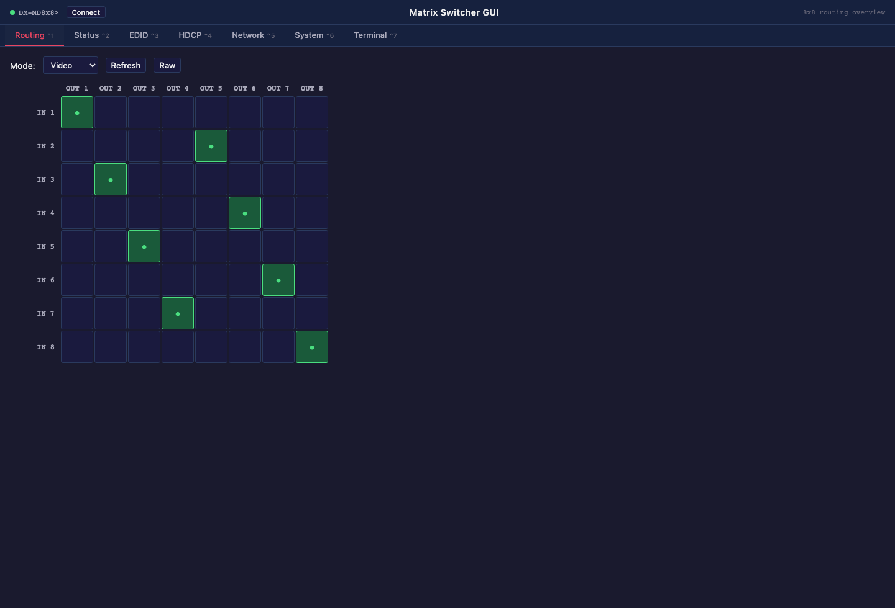
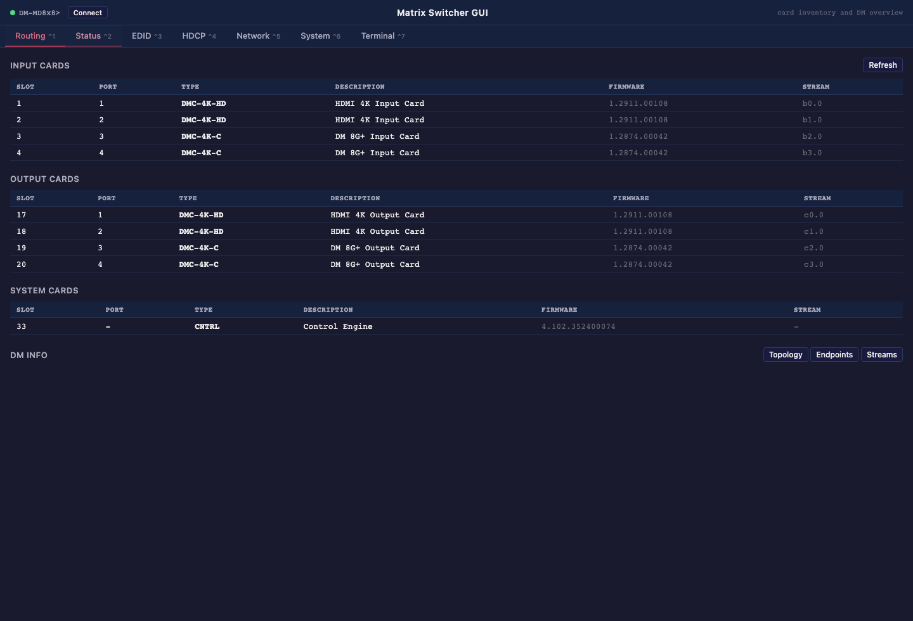
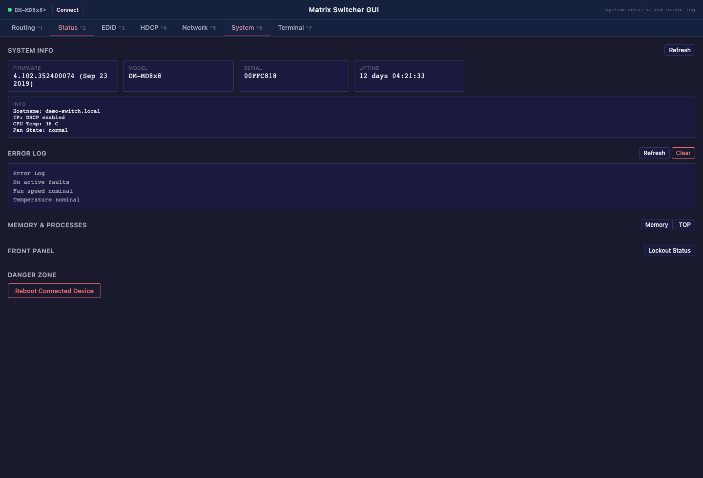

# crestron-dm-gui-tool

Browser-based control surface for Crestron DM-MD matrix switchers.

This project provides a lightweight Node.js server and browser UI for routing, status inspection, EDID and HDCP views, network/system queries, and raw console access over either the device's CTP interface or an SSH shell session.

Current release line: `0.0.3 Beta`

## Screenshots

### Routing Matrix



### Card Inventory



### System View



## Status and Compatibility

- Public release status: initial beta
- Validated targets: `DM-MD8x8`, `DM-MD16x16`
- The UI sizes itself from the connected chassis based on reported model and card layout.
- Response parsing is validated against output formats observed on DM-MD8x8 firmware `v4.102` and DM-MD16x16 prompt/card routing behavior.

## Features

- Video, audio, USB, AV, and AVU routing controls
- Card, status, EDID, HDCP, network, and system views
- Error log and reboot actions
- Raw terminal panel for direct console commands
- Browser UI with live connection status

## Security Model

- There is no authentication or authorization layer in this app.
- The raw command endpoint and terminal view can issue direct device commands.
- Run it only on a trusted local network or behind your own access controls.
- Do not expose it directly to the public internet.
- If you find a security issue, follow the disclosure guidance in [SECURITY.md](SECURITY.md).

## Requirements

- Node.js `18+`
- Network reachability from the host running this app to the switcher
- A switcher with CTP access enabled, or SSH console access with valid credentials

## Installation

```bash
git clone https://github.com/dieteradant/crestron-dm-gui-tool.git
cd crestron-dm-gui-tool
npm ci
cp .env.example .env
```

Edit `.env` as needed, then start the server:

```bash
npm start
```

Open `http://localhost:3000` in your browser unless you changed `SERVER_PORT`.

If `SWITCHER_HOST` is left blank, the web UI starts in a disconnected state and you can connect to a device from the header panel after the app loads.

## Configuration

| Variable | Required | Default | Description |
| --- | --- | --- | --- |
| `SWITCHER_HOST` | No | empty | Hostname or IP of the target switcher. Leave blank to start disconnected. |
| `SWITCHER_TRANSPORT` | No | `ctp` | Console transport to use: `ctp` or `ssh`. |
| `SWITCHER_PORT` | No | `41795` for `ctp`, `22` for `ssh` | Port used for the switcher connection. |
| `SWITCHER_USERNAME` | No | empty | SSH username. Required when `SWITCHER_TRANSPORT=ssh`. |
| `SWITCHER_PASSWORD` | No | empty | SSH password. Leave blank if the device accepts an empty password. |
| `SERVER_PORT` | No | `3000` | Local port for the Node.js web server. |

## Usage Notes

- Start disconnected if you do not want any default device assumptions in the repo or runtime.
- Use the `Connect` control in the header to point the UI at a different device without restarting the server.
- CPU3 and newer platforms may require `SSH` on port `22` instead of raw CTP on `41795`.
- SSH still requires a username even when the target is configured for an empty password. This app supports blank SSH passwords, but it does not assume anonymous SSH.
- Some newer Crestron platforms can present first-run SSH provisioning prompts such as `Username:`, `Password:`, and `Verify password:` before a console prompt is available.
- The terminal tab is intended for engineering and troubleshooting. It exposes raw device interaction.

## Known Limitations

- Other hardware families or firmware versions may return different output formats.
- Dynamic sizing assumes the switcher reports model and card inventory consistently with the current DM-MD command set.
- Failed SSH authentication can trigger controller-side IP blocking on CPU3 and newer systems. Avoid repeated credential guesses from the same host.
- There is no multi-user coordination, access control, or audit trail.

## Legal and Trademark Notice

This project is an independent, unofficial tool. It is not affiliated with, endorsed by, or sponsored by Crestron Electronics, Inc.

Crestron, DigitalMedia, DM-MD8x8, DM-MD16x16, and related marks are trademarks of Crestron Electronics, Inc.

This software is provided as-is, without warranty of any kind. Use it at your own risk, especially on production AV systems.

## Commercial Support

Commercial support, custom integration work, and private adaptations are available at `dieter@adant.io`.

## License

Licensed under the Apache License, Version 2.0. See [LICENSE](LICENSE) and [NOTICE](NOTICE).
